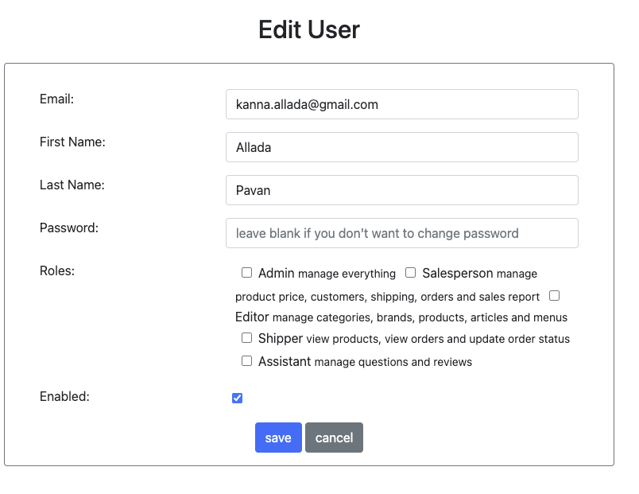

# 🚀 SharpLine Application

**SharpLine** is a full-featured eCommerce platform that combines a robust **Admin Management Console** for staff with a sleek **Customer Shopfront** experience. It provides powerful tools for managing products, orders, customer accounts, and staff users — all secured with role-based access control and intuitive UI.

Whether it's an administrator overseeing categories and reports or a customer browsing and reviewing products, SharpLine streamlines day-to-day operations across both ends of the platform.


---

## 📦 Features Overview

- Product CRUD operations
- Order & shipping tracking
- Role-specific analytics dashboard
- Content & article management
- Email notifications & customer inquiries


## ️🛠 Tech Stack
- **Java 17**
- **Spring Boot 2.3.1**
- **Spring MVC + Thymeleaf**
- **Spring Security 6**
- **Spring JDBC**
- **Junit 5**
- **MySQL**
- **Amazon S3** (for image/file storage)
- **jQuery + Bootstrap**
- **HTML5 / CSS3**
- **Git**
- **Docker**
- **Maven**

---


---


## 📁 Project Structure

```bash
SharpLine/
├── src/
│   └── main/
│       └── java/
│           └── com/
│               └── example/
│                   └── demo01/
│                       └── src/
│                           ├── Configuration/   # e.g. Exporter, Util Classes, Mail Configuration
│                           ├── Controller/      # REST or MVC controllers
│                           ├── DAO/             # Data access interfaces and custom queries
│                           ├── Exception/       # Custom exception handling
│                           ├── Filter/          # Request filters (e.g., JWT, logging)
│                           ├── Mapper/          # Entity-DTO mappers
│                           ├── Pojo/            # POJOs or entities (domain models)
│                           ├── Security/        # Security config and utilities
│                           ├── Service/         # Business logic services
│                           └── Demo01Application.java # Main Spring Boot application
├── assets/   # e.g. For READ.md Features Explanation
│   ├── login_screenshot.png
│   ├── dashboard_screenshot.png
│   └── manage_users_screenshot.png
├── README.md
├── pom.xml
└── Dockerfile
```

## 🔐 User Authentication

- **Secure Login Interface**: Users can log in to the SharpLine Control Panel using a clean and intuitive interface.
- **"Remember Me" Option**: Convenient checkbox allows users to stay signed in across sessions for quicker access.
- **Branding**: Custom branding with the SharpLine logo and a modern, minimal UI design.


---

## 🛠️ Admin Dashboard

- **Centralized Control Panel**: A unified interface to manage users, products, categories, orders, and more.
- **Role-Based Access**: Personalized access based on user roles such as Admin, Salesperson, Editor, Shipper, and Assistant.
- **Comprehensive Navigation**: Top navigation bar provides quick access to modules like Users, Categories, Products, Orders, Shipping, Articles, and Reports.
- **User Profile Dropdown**: Easily log out or manage your own profile through the user avatar menu.


---

## 👥 User Roles & Permissions

SharpLine supports multiple user roles, each with tailored access to specific parts of the system:

- **Admin** – Full access to all system features, including user management, product settings, and reports.
- **Salesperson** – Manages customer orders, handles sales inquiries, and views sales-related reports.
- **Editor** – Responsible for managing product listings, brand details, and content such as articles or announcements.
- **Shipper** – Handles shipping logistics, updates shipping statuses, and manages delivery-related tasks.
- **Assistant** – Limited access to assist with specific tasks such as answering customer questions or updating minor details.

Each user role sees a **custom dashboard view** and has access to only the features relevant to their responsibilities.

---

## 👨‍💼 User Management

- **Full User Directory**: Easily view and manage all registered users in the system, complete with profile photos and role assignments.
- **Enable/Disable Users**: Quickly toggle account status to control platform access.
- **Edit & Delete Actions**: Modify user details or remove users with a single click.
- **Role Visibility**: Instantly see each user’s assigned role (Admin, Salesperson, etc.) at a glance.
- **Data Export Options**: Export the entire user list to **CSV**, **Excel**, or **PDF** with one click — perfect for reporting or backups.
  
  <br></br>Manage Users

<br></br>Edit Users


---

## 🗂️ Category & Brand Management

- **Create / Edit Categories** with alias, name, and image
- **Create / Edit Brands**, associate them with categories
- Pagination and status toggling
- CSV / Excel / PDF export for both entities
- All images uploaded to AWS S3 Bucket
<br></br>Category Management
  
<br><br>Category Editing

  <br></br>Brand Management
  
<br></br>AWS S3 Image Uploading
  
<br></br>


---

## 📝 Review Management

- Admin view of all product reviews with customer names, timestamps, and ratings
- Star icon display for ratings
- Search and filter reviews by product or customer
- Quick access to **view**, **edit**, and **delete**
- Average rating per product calculated via SQL subquery
- Supports pagination and sorting


---

## 📊 Sales Reports

- Multiple views:
    - **By Date**
    - **By Category**
    - **By Product**
- Supports predefined and custom date ranges
- Calculates:
    - Total / Net / Average Gross Sales
    - Total Orders
- **Generated Bar Charts, Pie Charts, Text Tables using [Google Charts API](https://developers.google.com/chart)**


### Sales by Date 
Sales filtered by 7 Days


<br></br>Sales filtered by 28 Days

<br></br>Sales filtered by 6 months

&nbsp;

### Sales by Category

<br></br>Sales filtered by Category


&nbsp;

### Sales by Product
Sales filtered by Product


---

## ☁️ AWS S3 Integration

All image uploads (users, categories, brands, products) are securely stored on Amazon S3.

- Uses `PutObjectRequest` and public-read ACL
- File paths follow structured foldering (e.g., `category-images/{id}/{filename}`)
- Includes automatic folder cleanup before reupload


